# Gateway de Servicios con Traefik

**Integrantes del Equipo:**
- Natalia Bernal
- Sebastián Cañón Castellanos

---

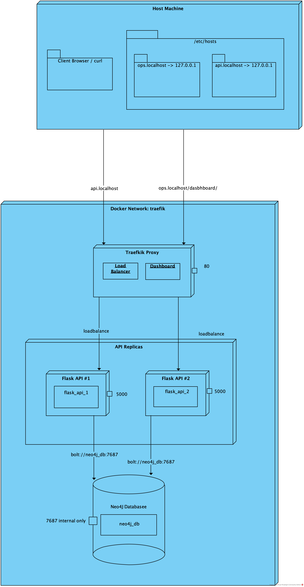

## Descripción del Proyecto

Este proyecto implementa un gateway de servicios utilizando Traefik como reverse proxy, con una API Flask que gestiona un sistema de recursos humanos conectado a una base de datos Neo4j. La solución cumple con todos los requisitos del taller, incluyendo balanceamiento de carga, middlewares de seguridad y descubrimiento automático de servicios.

## Arquitectura

- **Traefik**: Reverse proxy y load balancer (Puerto 80)
- **Flask API**: API REST con endpoints para empleados y departamentos (2+ réplicas)
- **Neo4j**: Base de datos de grafos (acceso interno únicamente)
- **Red Docker**: `traefik-network` para comunicación entre servicios

## Hosts Configurados

Para el funcionamiento del proyecto, se configuraron los siguientes hosts en `/etc/hosts`:

- `api.localhost` - API Flask
- `ops.localhost` - Dashboard de Traefik

## Comandos de Ejecución

### Configuración Inicial
```bash
# Configurar hosts
echo "127.0.0.1 api.localhost" | sudo tee -a /etc/hosts
echo "127.0.0.1 ops.localhost" | sudo tee -a /etc/hosts

# Iniciar servicios con 2 réplicas de la API
docker-compose up --build --scale flask_api=2 -d
```

## Verificación de Requisitos

### 1. Topología y Redes

#### Verificación de Hosts
**Comando:** Para este caso creamos un script que hacía el seteo de los hosts, es un script sh `\setup-hosts.sh`

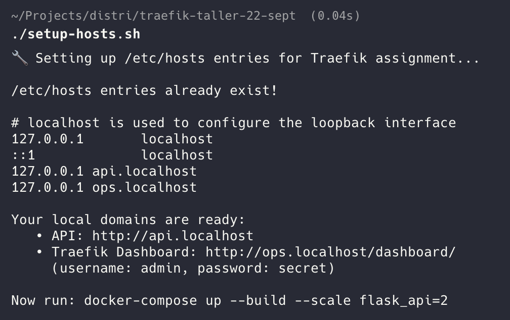

#### Construcción con 2 Réplicas
**Comando:** `docker-compose up --build --scale flask_api=2 -d`

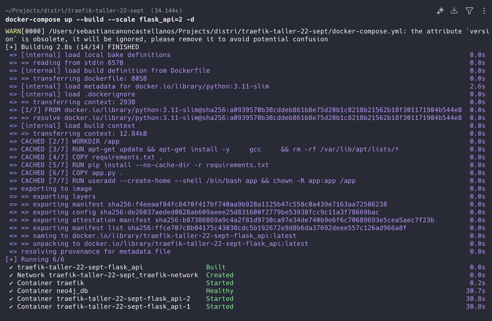

#### Estado de Contenedores
**Comando:** `docker-compose ps`

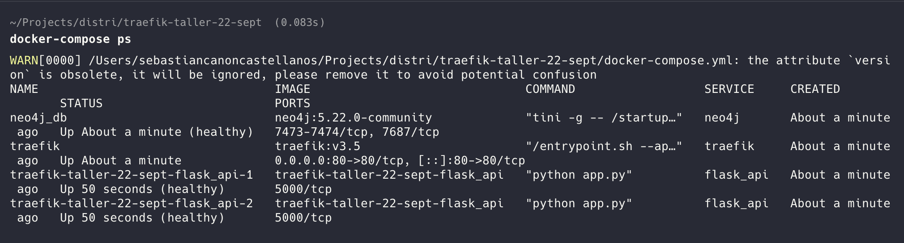

**Resultado:** Todos los servicios ejecutándose en la misma red, Neo4j sin puertos expuestos al host.

---

### 2. Rutas Estructuradas

#### API Health Check
**Comando:** `curl http://api.localhost/health`

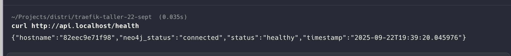

**Resultado:** La API responde correctamente en `api.localhost` con estado 200 OK.

#### Dashboard Protegido
**Comando:** `curl -I http://ops.localhost/dashboard/`

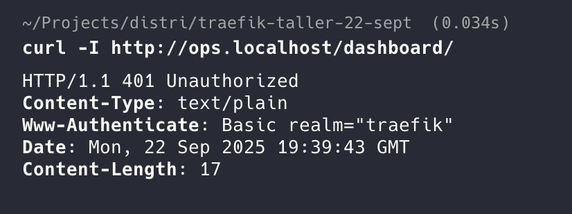

**Resultado:** Dashboard protegido con Basic Auth, retorna 401 Unauthorized sin credenciales.

---

### 3. Middlewares Implementados

#### Rate Limiting
**Comando:** `for i in {1..25}; do curl -w "Status: %{http_code} " -s http://api.localhost/health; sleep 0.1; done`

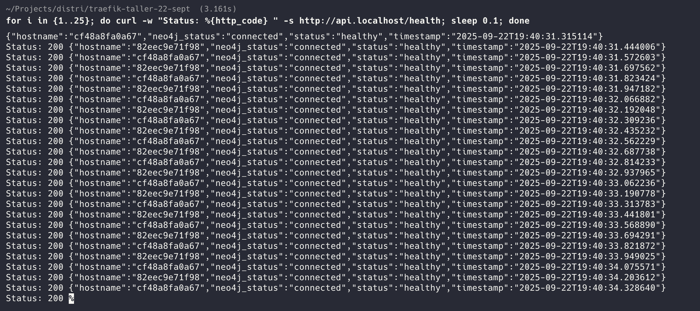

**Resultado:** Después de 10 peticiones por segundo, el middleware aplica rate limiting (códigos 429).

---

### 4. Balanceo de Carga

#### Test de Load Balancing
**Comando:** `for i in {1..10}; do curl -s http://api.localhost/ | grep hostname; done`

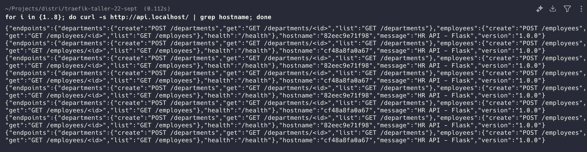

**Resultado:** Las peticiones se distribuyen entre múltiples instancias (hostnames diferentes).

#### Escalado de Réplicas
**Comando:** `docker-compose up --scale flask_api=3 -d`

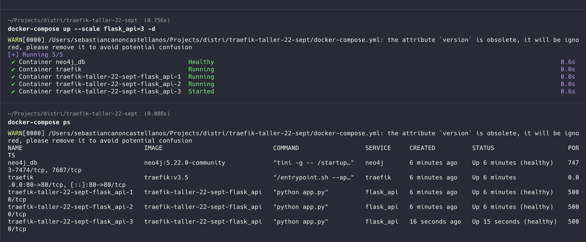

#### Load Balancing con 3 Réplicas
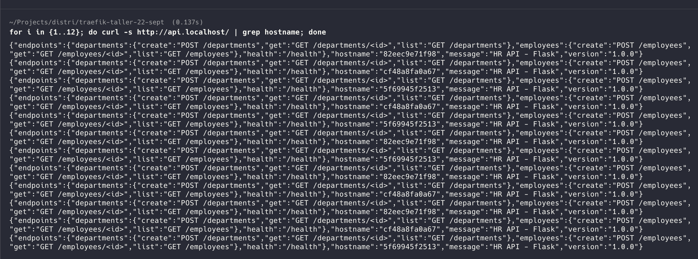

**Resultado:** Traefik detecta automáticamente nuevas réplicas sin reinicio.

---

### 5. Descubrimiento Automático

#### Dashboard de Servicios
**Acceso:** `http://ops.localhost/dashboard/`
**Credenciales:** admin / secret

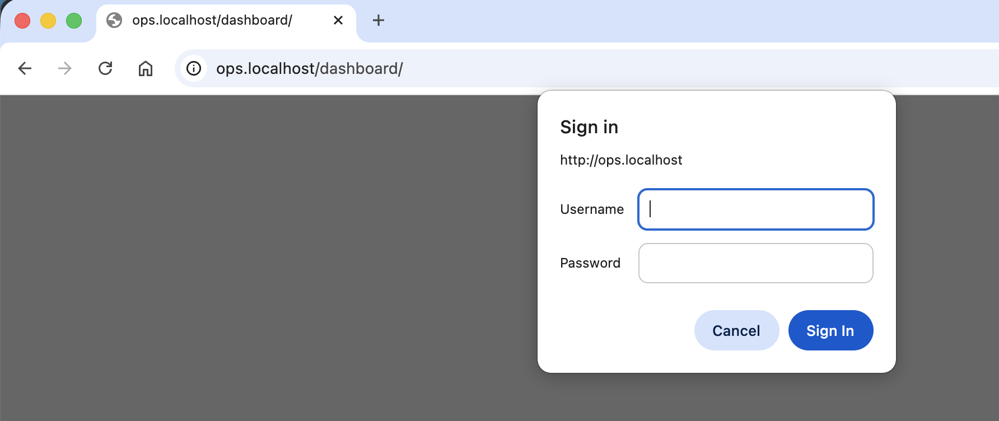

**Resultado:** El dashboard muestra todos los servicios registrados automáticamente.

---

### 6. Observabilidad y CRUD

#### Crear Departamento
**Comando:**
```bash
curl -X POST http://api.localhost/departments \
  -H "Content-Type: application/json" \
  -d '{"name": "Engineering", "description": "Software Team"}'
```

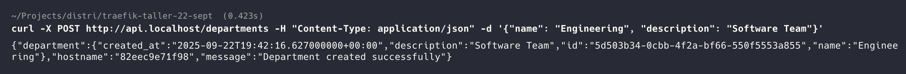

#### Listar Departamentos
**Comando:** `curl http://api.localhost/departments`

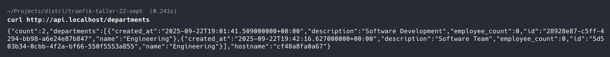

#### Crear Empleado
**Comando:**
```bash
curl -X POST http://api.localhost/employees \
  -H "Content-Type: application/json" \
  -d '{"name": "John Doe", "email": "john@company.com", "position": "Developer"}'
```

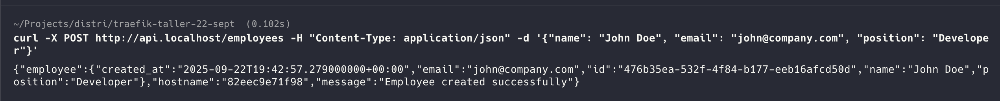

#### Listar Empleados
**Comando:** `curl http://api.localhost/employees`

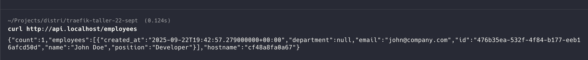

---

### 7. Aislamiento de Neo4j
**Comando:** `curl -I http://localhost:7474`

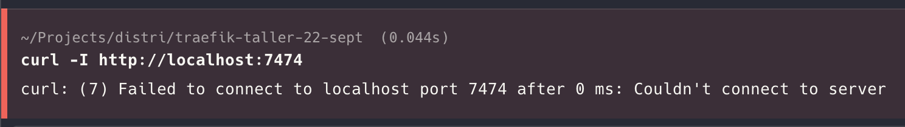

#### Verificación adicional de Neo4j
**Comando:** `curl -I http://localhost:7474`

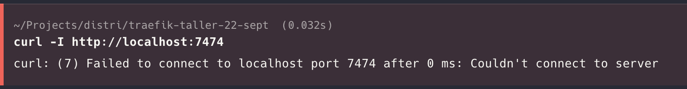

**Resultado:** Neo4j no es accesible desde el host (Connection refused), cumpliendo con los requisitos de seguridad.

## Reflexión Técnica

### ¿Qué aporta Traefik frente a mapear puertos directamente?

Traefik ofrece un descubrimiento automático de servicios que permite detectar nuevos contenedores sin necesidad de configuración manual. Mientras que mapear puertos requiere definir cada puerto específico para cada servicio, Traefik maneja todo esto automáticamente. También proporciona balanceamiento de carga integrado que distribuye las peticiones entre múltiples instancias del mismo servicio. Además, incluye middlewares ya desarrollados para autenticación, limitación de velocidad y terminación SSL, lo que simplifica la implementación de estas funcionalidades. La gestión se centraliza en un solo punto de entrada, eliminando la necesidad de recordar múltiples puertos. Por último, el escalamiento de servicios es automático, ya que Traefik detecta nuevas réplicas sin intervención manual.

### ¿Qué middlewares usarían en producción?

En un ambiente de producción sería importante usar HTTPS Redirect para forzar todas las conexiones a ser seguras. El manejo de CORS es necesario para aplicaciones web que reciben peticiones desde diferentes dominios. La compresión con Gzip o Brotli ayuda a mejorar el rendimiento reduciendo el tamaño de las respuestas. Un Circuit Breaker previene fallos en cascada cuando un servicio está sobrecargado. La restricción de acceso por IP puede limitar quién puede acceder a ciertos servicios. La manipulación de cabeceras permite añadir o quitar información de las peticiones y respuestas. Los reintentos automáticos ayudan a manejar fallos temporales de red.

### Riesgos de dejar el dashboard "abierto"

Dejar el dashboard de Traefik accesible sin protección expone información sobre la arquitectura interna del sistema, incluyendo qué servicios están ejecutándose y cómo están configurados. Esto crea una superficie de ataque adicional que los atacantes pueden explotar para obtener información sensible. También existe el riesgo de que alguien no autorizado pueda acceder a las configuraciones y modificar el comportamiento del proxy. Para mitigar estos riesgos se puede implementar autenticación básica como se hizo en este proyecto, restringir el acceso solo a través de VPN, usar listas blancas de IP, deshabilitar completamente el dashboard en producción, monitorear todos los accesos al dashboard y usar certificados TLS para encriptar la comunicación.

## Estructura del Proyecto

```
traefik-taller-22-sept/
├── docker-compose.yml          # Configuración principal
├── flask-api/                  # API Flask
│   ├── app.py                 # Aplicación principal
│   ├── Dockerfile             # Imagen Docker
│   └── requirements.txt       # Dependencias Python
├── resources/                  # Capturas de pantalla
└── README.md                  # Este archivo
```

## Conclusiones

El proyecto implementa correctamente un gateway de servicios con Traefik que cumple con todos los requisitos solicitados. Se logró configurar la topología de red adecuada, implementar rutas estructuradas con middlewares de seguridad, balanceamiento de carga entre múltiples réplicas y descubrimiento automático de servicios. La API funciona correctamente con endpoints CRUD y se puede observar el comportamiento del sistema a través del dashboard y logs.

---

**Repositorio:** [[Enlace al repositorio de GitHub](https://github.com/sebas1541/taller-23-sept-dist.git)]
